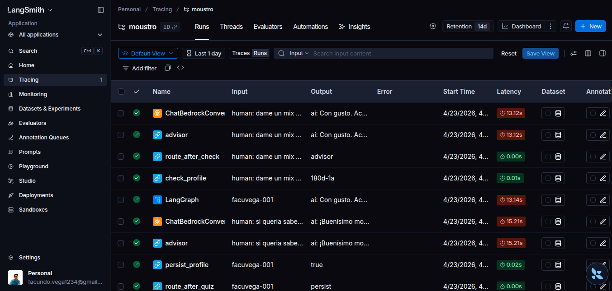

# Proyecto Moustro (Banco Moustro)

**Banco Moustro** es una demo de banca con **agente conversacional** de punta a punta: el usuario habla desde el navegador y, detrás, un **backend Java con Spring Boot** concentra la API de producto (préstamos, refinanciación, perfil inversor, reclamos) mientras la capa de IA —en **Python**, con **LangGraph** y orquestación por **Kafka**— encadena el razonamiento sin bloquear el hilo de negocio. El **clasificador**, el **master**, el **brain** y cada **workflow** LangGraph de dominio (**préstamos**, **inversión**) son **microservicios** distintos: cada uno es su propio proceso y contenedor en Compose (imagen propia, escalado independiente), no un único servicio Python monolítico. La arquitectura es **orientada a eventos**: los mensajes viajan por streams, los servicios reaccionan de forma **asíncrona** y el sistema escala en ideas de *workers* y consumidores, no en un solo bloque de IA.

Sobre **AWS Bedrock** se apoya en **Anthropic Claude** con un reparto claro: **Claude Haiku** hace el trabajo **liviano y veloz** —triaje, clasificación de intención, ruteo hacia el módulo que corresponde—; **Claude Sonnet** se reserva para lo **exigente**: razonar con contexto, usar herramientas, armar explicaciones de préstamos o inversiones con la profundidad que el cliente merece. Así se optimizan **latencia y costo** sin sacrificar calidad cuando el trámite lo pide.

El diseño apuesta a **código asíncrono** y a **colas/streams** desacoplados: hoy levantás todo con **`docker compose`**, mañana el mismo desglose de procesos se mapea sin drama a **Kubernetes** (réplicas, autoscaling por servicio, service mesh si el equipo lo pide) porque el contrato son eventos y APIs, no acoplamiento fijo entre procesos.

---

## Arquitectura


### Visión general

1. **Frontend** (`bank-front`): Vue 3 + Vite; el navegador llama a la API Java (p. ej. `http://localhost:8080/api`).
2. **Core** (`core-service-java/bank-ia`): Spring Boot, PostgreSQL (`banco-db`), publica y consume **eventos Kafka** (reclamos, respuestas de chat, etc.).
3. **Clasificador** (`ai-brain-python/services/classifier`): **consumidor** de Kafka; según el mensaje y el estado en **Redis**, enruta hacia el stream del master o del “brain” y workflows.
4. **Master** (microservicio `services/master`): grafo **LangGraph** (primera capa conversacional); checkpoints en **Redis**; puede derivar al brain (p. ej. `[DERIVAR]`).
5. **Brain** (microservicio `services/brain`): lee `to-brain`, decide **workflow** (`workflow_loans` / `workflow_investment`) con caché y TTL en Redis, y reenvía al stream del microservicio que corresponda.
6. **Workflows LangGraph** — un **microservicio por dominio**: `workflow-loans` y `workflow-investment` en Compose (código en `workflows/loans` y `workflows/investment`). Cada uno consume su **stream** de Kafka, ejecuta su grafo con **herramientas** contra el core (`CORE_API_URL`), y persiste estado en Redis + conversaciones en `postgres_conversation` cuando aplica.

**Infraestructura compartida:** **Kafka** (tópicos/streams), **Redis** (sesión, `brain_workflow`, **checkpoints de LangGraph**, grupos de lectura de streams), **dos PostgreSQL** (negocio vs. historial guardado de conversación).

### Por eventos y código asíncrono

- Los servicios Python usan **asyncio** (clientes no bloqueantes, `async/await`) y se enganchan a Kafka con bucles de consumo adecuados a streaming.
- El **front no acopla** a un único monolito de IA: **clasificador**, **master**, **brain** y **cada workflow** son servicios desplegables por separado; cada uno reacciona a **eventos** en su cola o stream.
- Ese desacoplamiento es lo que hace razonable un salto a **K8s**: un **Deployment** (o *Knative* / colas administradas) por microservicio de LangGraph, colas o streams como contrato, y Redis/Kafka/Postgres como *backing services* gestionados o operadores.

### Memoria en Redis (corto plazo) y PostgreSQL (persistencia)

En este proyecto **no hay un único “chip de memoria”**: se combina **Redis** para el **trabajo en curso** y **PostgreSQL** para cosas **duraderas** y consultables después.

**Redis — memoria operativa / corto plazo**

- **Checkpoints de LangGraph** (`AsyncRedisSaver`): el estado del grafo (mensajes del hilo, pasos) se guarda asociado al `thread_id` (típicamente el `customer_id`). Sirve para **seguir la misma conversación** en varios turnos sin reenviar todo el historial “a mano”. Es **rápido** y **volátil en la práctica**: depende de políticas de Redis, TTL de otras claves y limpieza; no está pensado como archivo legal de la charla.
- **`session:{customerId}`** (TTL ~30 min): indica a qué stream de Kafka debe ir el **siguiente** mensaje del usuario (p. ej. `to-brain` tras una derivación).
- **`brain_workflow:{customerId}`** (TTL alineado al clasificador, p. ej. 30 min): recuerda **qué workflow del brain** está activo (`workflow_loans` / `workflow_investment`) para no reclasificar en cada tecla.
- **`post_close:{customerId}`** (TTL ~15 min): flag tras un cierre tipo “¿algo más?” para que el clasificador pueda **resetear sesión** en el mensaje siguiente sin arrastrar el módulo anterior.

En conjunto, Redis actúa como **memoria de trabajo** del pipeline: barata en latencia, con **expiración** y orientada a **sesión activa**.

**PostgreSQL — memoria durable / largo plazo (tres lecturas útiles)**

1. **`conversation-db` (puerto 5433 en local)** — tabla `conversations` (`common/conversation_store.py`): tras un turno en **master** o en un **workflow**, se puede **insertar** un registro con `customer_id`, `service` (p. ej. `master`, `loans`, `investment`) y un **JSONB** de mensajes simplificados (rol + contenido). Es un **historial guardado** para auditoría, analítica o futuras integraciones; **no** reemplaza al checkpointer de LangGraph para reanudar el grafo en caliente (eso sigue en Redis mientras exista el checkpoint).
2. **`banco-db` (puerto 5432)** — datos de **negocio** del core Java: préstamos, ofertas, operaciones de refinanciación, **perfil inversor**, etc. Es la “memoria larga” del **cliente como entidad bancaria**, no del texto del chat.

**Resumen:** Redis = **contexto vivo** del flujo de IA y del enrutado (segundos/minutos, con TTL). PostgreSQL = **persistencia relacional**: historial de conversación en un esquema dedicado y **estado de producto** en el esquema del banco. *(Nota: “PostgREST” es otro producto; aquí se usa el cliente/servidor **PostgreSQL** estándar.)*

---

## Variables de entorno (`.env`)

Copiá **`.env.example`** a **`.env`** y completá los valores. **No subas `.env` al repositorio.**

| Variable | Uso |
|----------|-----|
| `VITE_API_URL` | Base URL de la API para el build del front (en Docker apunta al servicio; en local suele ser `http://localhost:8080/api`). |
| `AWS_ACCESS_KEY_ID` / `AWS_SECRET_ACCESS_KEY` | Credenciales **IAM** de AWS. El runtime de `langchain_aws` + Bedrock invoca la API con **firma SigV4**; no es un “token Bearer” suelto como en algunos LLMs, sino clave/ secreto de IAM con permisos a **Amazon Bedrock** (InvokeModel / Converse) en la cuenta. |
| `AWS_REGION` | Región donde están habilitados los modelos Bedrock. Debe alinearse con el catálogo de modelos y con las políticas IAM. En el código, `get_bedrock_model_master` y `get_bedrock_model_brain` leen `AWS_REGION` (puedes unificar o usar perfiles/variables por entorno). |
| `AWS_PRIMARY_LLM` / `AWS_SECOND_LLM` | **IDs de modelo** en Bedrock (p. ej. Haiku para triaje, Sonnet para razonamiento con tools), no claves. Los tokens de la inferencia los gestiona **Bedrock** al invocar el modelo. |
| `REDIS_URL` | Conexión a Redis: sesión, caché de módulo del brain, **checkpoints de LangGraph** (estado de grafo por `thread`/`customer`), y auxiliares de streams. |
| `CORE_API_URL` | Base del core Java visto desde los workflows (rutas bajo `.../bank-ia`). |
| `LANGCHAIN_TRACING_V2`, `LANGCHAIN_API_KEY`, `LANGCHAIN_PROJECT` | **Observabilidad (LangSmith)**: el “API key” es de **LangSmith** (trazas y depuración), no de Bedrock. Si no querés trazas, podés dejarlo desactivado o sin clave según tu configuración. |

Con el tracing activo, en **[LangSmith](https://smith.langchain.com)** (menú **Tracing**) elegís el proyecto con el mismo nombre que `LANGCHAIN_PROJECT` y ves los **runs** al usar el chat. Ejemplo de captura:



### LangGraph y “estado” (a menudo confundido con “tokens”)

- **LangGraph** persiste el **estado del grafo** (pasos, mensajes, reanudación de diálogo) en **Redis** vía un checkpointer; eso no son “tokens de LLM”, sino **serialización de estado** + metadatos del run.
- Los **tokens de consumo** del modelo (entrada/salida) los cobra **AWS Bedrock** según el modelo y la llamada; se controlan con **límites de cuenta, presupuestos e IAM**, no con una variable de “token de LangGraph” en el `.env` salvo en sentido de **LangSmith** arriba.

---

## Estructura del repositorio

| Ruta | Rol |
|------|-----|
| `bank-front/` | SPA Vue: chat y consumo de API. |
| `core-service-java/bank-ia/` | API REST, dominio de préstamos, ofertas, refinanciación, perfil inversor. |
| `ai-brain-python/` | Classifier, master, brain, workflows (préstamos / inversión), `common/`. |
| `images/` | Diagrama de arquitectura, captura opcional de trazas LangSmith, etc. |
| `docker-compose.yml` | Orquestación local (equivalente lógico a un stack de servicios en K8s). |
| `.env.example` | Plantilla de variables (copiar a `.env`). |

---

## Requisitos

- Docker y Docker Compose
- Cuenta **AWS** con **Amazon Bedrock** habilitado y credenciales IAM mínimas para invocar los modelos configurados
- Archivo **`.env`** a partir de **`.env.example`**

## Clonar el repositorio

Asegurate de tener [Git](https://git-scm.com/) instalado. En la terminal:

```bash
git clone https://github.com/facuvgaa/banco-ia-brain.git
cd banco-ia-brain
```

Si usás **SSH** (clave cargada en GitHub):

```bash
git clone git@github.com:facuvgaa/banco-ia-brain.git
cd banco-ia-brain
```

Para **actualizar** el código más adelante, desde la carpeta del proyecto:

```bash
git pull origin main
```

(El branch por defecto puede ser `main`; ajustá si tu remoto usa otro nombre.)

## Cómo levantar el entorno

Desde la **raíz del repositorio** (donde está `docker-compose.yml`):

```bash
cp .env.example .env
# Completar AWS_* y, si aplica, LANGCHAIN_API_KEY
docker compose up -d --build
```

Puertos habituales:

- **Frontend**: [http://localhost:5173](http://localhost:5173)
- **API Java**: [http://localhost:8080](http://localhost:8080) — prefijo `/api/v1/bank-ia/...`
- **Redis**: `localhost:6379`
- **PostgreSQL (core)**: `localhost:5432`
- **PostgreSQL (conversaciones)**: `localhost:5433`
- **Kafka**: `localhost:9092`

```bash
docker compose down
```

## Notas de producto

- **Préstamos / refinanciación**: reglas y datos en el core; los workflows consumen `CORE_API_URL`.
- **Inversión**: cuestionario y perfil inversor vía core; orquestado en el grafo correspondiente.
- **Cambio de módulo** (p. ej. de préstamos a inversión): suele requerir un mensaje explícito con intención (p. ej. “inversiones”); el clasificador y Redis actualizan el flujo.

## Licencia

[Código MIT](Licence) — Proyecto Moustro y colaboradores.

---

# English

**Repository:** [github.com/facuvgaa/banco-ia-brain](https://github.com/facuvgaa/banco-ia-brain)

**Banco Moustro** is an end-to-end **conversational banking** demo: the user talks from the browser while a **Java + Spring Boot** backend centralizes the product API (loans, refinancing, investor profile, claims). The AI layer — **Python**, **LangGraph**, **Kafka**-driven — chains reasoning without blocking the business path. The **classifier**, **master**, **brain**, and each domain **LangGraph workflow** (**loans**, **investment**) are **separate microservices**: their own process and Compose container (own image, independent scaling), not one monolithic Python service. The stack is **event-driven**: messages flow over streams, services react **asynchronously**, and you scale with workers and consumers, not a single AI blob.

On **AWS Bedrock**, **Anthropic Claude** is used in a clear split: **Claude Haiku** for **fast, light** work —triage, intent classification, routing to the right module—; **Claude Sonnet** for the **heavy** work: contextual reasoning, tool use, and loan/investment explanations with the depth customers need. **Latency and cost** are optimized without giving up quality when the flow demands it.

The design favors **asynchronous code** and **decoupled queues/streams**: run everything with **`docker compose` today**; the same process split maps cleanly to **Kubernetes** later (replicas, per-service autoscaling, service mesh if you need it) because the contract is events and APIs, not hard coupling.

---

## Architecture


### Overview

1. **Frontend** (`bank-front`): Vue 3 + Vite; the browser calls the Java API (e.g. `http://localhost:8080/api`).
2. **Core** (`core-service-java/bank-ia`): Spring Boot, PostgreSQL (`banco-db`), publishes and consumes **Kafka** events (claims, chat responses, etc.).
3. **Classifier** (`ai-brain-python/services/classifier`): **Kafka** consumer; routes to the master or “brain” streams and workflows using **Redis** state.
4. **Master** (microservice `services/master`): **LangGraph** (first conversational layer); **Redis** checkpoints; can hand off to the brain (e.g. `[DERIVAR]`).
5. **Brain** (microservice `services/brain`): reads `to-brain`, picks **workflow** (`workflow_loans` / `workflow_investment`) with Redis cache + TTL, forwards to the right microservice stream.
6. **LangGraph workflows** — **one microservice per domain**: `workflow-loans` and `workflow-investment` in Compose (code under `workflows/loans` and `workflows/investment`). Each consumes its **Kafka** stream, runs its graph with **tools** against the core (`CORE_API_URL`), and persists state in Redis + `postgres_conversation` when applicable.

**Shared infra:** **Kafka** (topics/streams), **Redis** (session, `brain_workflow`, **LangGraph** checkpoints, stream consumer groups), **two PostgreSQL** instances (business data vs. stored conversation log).

### Events and async code

- Python services use **asyncio** (non-blocking clients, `async/await`) and attach to Kafka with streaming-friendly consumer loops.
- The **front** is not tied to a single AI monolith: **classifier**, **master**, **brain**, and **each workflow** are independently deployable; each reacts to **events** on its queue or stream.
- That decoupling is what makes a **K8s** move reasonable: one **Deployment** (or *Knative* / managed queues) per LangGraph microservice, streams as the contract, and Redis/Kafka/Postgres as managed *backing services* or operators.

### Memory: Redis (short term) and PostgreSQL (durable)

There is **no single “memory chip”** here: **Redis** holds **in-flight** work; **PostgreSQL** holds **durable**, queryable data.

**Redis — operational / short term**

- **LangGraph checkpoints** (`AsyncRedisSaver`): graph state (thread messages, steps) is stored under a `thread_id` (usually `customer_id`) so the **same conversation** continues across turns without hand-rolling the full history. It is **fast** and **operationally volatile** (Redis policy, other key TTLs, cleanup); it is not a legal archive of the chat.
- **`session:{customerId}`** (~30 min TTL): which Kafka stream the **next** user message should use (e.g. `to-brain` after a handoff).
- **`brain_workflow:{customerId}`** (aligned with classifier, e.g. 30 min TTL): which **brain workflow** is active (`workflow_loans` / `workflow_investment`) to avoid reclassifying every keystroke.
- **`post_close:{customerId}`** (~15 min TTL): set after a “anything else?”-style close so the classifier can **reset session** on the next turn without dragging the old module.

Together, Redis is **working memory** for the pipeline: low latency, **expiry**, **active session** oriented.

**PostgreSQL — durable / long term**

1. **`conversation-db` (port 5433 locally)** — `conversations` table (`common/conversation_store.py`): after a turn in **master** or a **workflow**, an **insert** with `customer_id`, `service` (e.g. `master`, `loans`, `investment`) and a **JSONB** of simplified messages (role + content). **Saved history** for audit, analytics, or future integrations; it does **not** replace the LangGraph checkpointer for hot resumption (that stays in Redis while the checkpoint exists).
2. **`banco-db` (port 5432)** — **business** data in the Java core: loans, offers, refinance ops, **investor profile**, etc. “Long memory” of the **customer as a banking entity**, not chat prose.

**Summary:** Redis = **live** AI/routing context (seconds–minutes, TTLs). PostgreSQL = **relational persistence**: conversation log in a dedicated schema and **product state** in the bank schema. *(“PostgREST” is a different product; this repo uses standard **PostgreSQL** clients/servers.)*

---

## Environment variables (`.env`)

Copy **`.env.example`** to **`.env`** and fill in values. **Do not commit `.env`.**

| Variable | Purpose |
|----------|---------|
| `VITE_API_URL` | API base URL for the front build (Docker points to the service; locally often `http://localhost:8080/api`). |
| `AWS_ACCESS_KEY_ID` / `AWS_SECRET_ACCESS_KEY` | **IAM** credentials. `langchain_aws` + Bedrock use **SigV4**; this is not a random Bearer token but IAM key/secret with **Amazon Bedrock** (InvokeModel / Converse) permissions. |
| `AWS_REGION` | Region where Bedrock models are enabled; must match IAM and model availability. `get_bedrock_model_master` and `get_bedrock_model_brain` read `AWS_REGION` (you can unify or use env-specific values). |
| `AWS_PRIMARY_LLM` / `AWS_SECOND_LLM` | **Bedrock model IDs** (e.g. Haiku for triage, Sonnet for tool-heavy reasoning), not API keys. Inference tokens are billed by **Bedrock** on each call. |
| `REDIS_URL` | Redis: session, brain module cache, **LangGraph** checkpoints (graph state per `thread`/`customer`), stream helpers. |
| `CORE_API_URL` | Java core base as seen from workflows (paths under `.../bank-ia`). |
| `LANGCHAIN_TRACING_V2`, `LANGCHAIN_API_KEY`, `LANGCHAIN_PROJECT` | **Observability (LangSmith)**: the key is a **LangSmith** API key (traces, debugging), not Bedrock. You can turn tracing off or leave the key empty depending on your setup. |

With tracing on, open **[LangSmith](https://smith.langchain.com)** → **Tracing** → pick the project named like `LANGCHAIN_PROJECT` to see **runs** when you use the chat. Example:


### LangGraph “state” (often confused with “tokens”)

- **LangGraph** stores **graph state** (steps, messages, resuming a dialog) in **Redis** through a checkpointer; that is **not** “LLM tokens” but **serialized state** + run metadata.
- **LLM** input/output **tokens** are charged by **AWS Bedrock** per model and call; they are controlled by **account limits, budgets, and IAM**, not a “LangGraph token” in `.env` except in the **LangSmith** sense above.

---

## Repository layout

| Path | Role |
|------|------|
| `bank-front/` | Vue SPA: chat and API client. |
| `core-service-java/bank-ia/` | REST API, loans, offers, refinance, investor profile. |
| `ai-brain-python/` | Classifier, master, brain, workflows, `common/`. |
| `images/` | Architecture diagram, optional LangSmith screenshot, etc. |
| `docker-compose.yml` | Local orchestration (logical equivalent to a K8s stack). |
| `.env.example` | Environment template (copy to `.env`). |

---

## Requirements

- Docker and Docker Compose
- **AWS** account with **Amazon Bedrock** and minimal IAM to invoke the configured models
- **`.env`** file from **`.env.example`**

## Clone the repository

Install [Git](https://git-scm.com/). In a terminal:

```bash
git clone https://github.com/facuvgaa/banco-ia-brain.git
cd banco-ia-brain
```

**SSH** (key loaded on GitHub):

```bash
git clone git@github.com:facuvgaa/banco-ia-brain.git
cd banco-ia-brain
```

**Update** later, from the project folder:

```bash
git pull origin main
```

(Default branch is often `main`; adjust if your remote uses a different name.)

## Run the stack

From the **repository root** (where `docker-compose.yml` lives):

```bash
cp .env.example .env
# Set AWS_* and, if you want traces, LANGCHAIN_API_KEY
docker compose up -d --build
```

Default ports:

- **Frontend**: [http://localhost:5173](http://localhost:5173)
- **Java API**: [http://localhost:8080](http://localhost:8080) — prefix `/api/v1/bank-ia/...`
- **Redis**: `localhost:6379`
- **PostgreSQL (core)**: `localhost:5432`
- **PostgreSQL (conversations)**: `localhost:5433`
- **Kafka**: `localhost:9092`

```bash
docker compose down
```

## Product notes

- **Loans / refinance**: business rules and data in the core; workflows call `CORE_API_URL`.
- **Investments**: suitability questionnaire and investor profile through the core; orchestrated in the corresponding graph.
- **Switching modules** (e.g. loans → investments): usually needs an explicit intent (e.g. “inversiones” / “investments”); classifier + Redis update the active flow.

## License

[MIT](Licence) — Moustro project and contributors.
