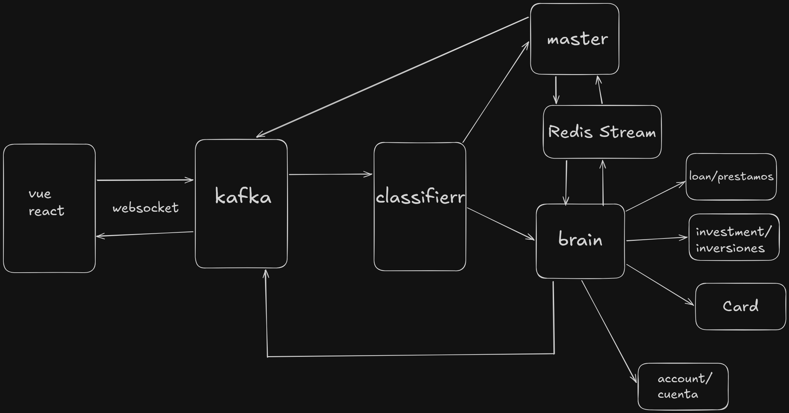

# Proyecto Moustro (Banco Moustro)

**Repositorio:** [github.com/facuvgaa/banco-ia-brain](https://github.com/facuvgaa/banco-ia-brain)

Demo de banca con asistente conversacional: el usuario chatea desde el navegador, el backend orquesta el flujo con **Kafka** (arquitectura **orientada a eventos**), servicios **Python** asíncronos con **LangGraph** y modelos en **AWS Bedrock**, y un **core Java (Spring Boot)** expone la API REST de productos (préstamos, refinanciación, perfil inversor, etc.).

El diseño prioriza **código asincrónico** y **colas/streams** desacoplados, de forma que en el futuro se pueda **desplegar en Kubernetes** (múltiples réplicas, autoscaling por consumidor, service mesh opcional) sin reescribir el núcleo del flujo: hoy `docker compose` levanta el mismo reparto de procesos que podrían ser Pods con los mismos binarios e imágenes.

---

## Arquitectura



### Visión general

1. **Frontend** (`bank-front`): Vue 3 + Vite; el navegador llama a la API Java (p. ej. `http://localhost:8080/api`).
2. **Core** (`core-service-java/bank-ia`): Spring Boot, PostgreSQL (`banco-db`), publica y consume **eventos Kafka** (reclamos, respuestas de chat, etc.).
3. **Clasificador** (`ai-brain-python/services/classifier`): **consumidor** de Kafka; según el mensaje y el estado en **Redis**, enruta hacia el stream del master o del “brain” y workflows.
4. **Master** (`ai-brain-python/services/master`): grafo **LangGraph** (primera capella conversacional); usa checkpoints en **Redis**; puede marcar derivación al brain (p. ej. `[DERIVAR]`).
5. **Brain** (`ai-brain-python/services/brain`): lee `to-brain`, decide **workflow** (`workflow_loans` / `workflow_investment`) con caché y TTL en Redis, y reenvía al stream correcto.
6. **Workflows** (`workflows/loans`, `workflows/investment`): cada uno es un proceso **asíncrono** que consume su stream de Kafka, ejecuta un grafo LangGraph con **herramientas** que llaman al core vía `CORE_API_URL`, y persiste estado en Redis + conversaciones en `postgres_conversation` cuando aplica.

**Infraestructura compartida:** **Kafka** (tópicos/streams), **Redis** (sesión, `brain_workflow`, **checkpoints de LangGraph**, grupos de lectura de streams), **dos PostgreSQL** (negocio vs. historial guardado de conversación).

### Por eventos y código asíncrono

- Los servicios Python usan **asyncio** (clientes no bloqueantes, `async/await`) y se enganchan a Kafka con bucles de consumo adecuados a streaming.
- El **front no acopla** a un único monolito de IA: cada pieza reacciona a **eventos** (nuevo mensaje de usuario, mensaje hacia un workflow, salida hacia el front vía mecanismos del core).
- Ese desacoplamiento es lo que hace razonable un salto a **K8s**: colas o streams como contrato, servicios con procesos o workers horizontales, y Redis/Kafka/Postgres como backing services gestionados o operadores.

---

## Variables de entorno (`.env`)

Copiá **`.env.example`** a **`.env`** y completá los valores. **No subas `.env` al repositorio.**

| Variable | Uso |
|----------|-----|
| `VITE_API_URL` | Base URL de la API para el build del front (en Docker apunta al servicio; en local suele ser `http://localhost:8080/api`). |
| `AWS_ACCESS_KEY_ID` / `AWS_SECRET_ACCESS_KEY` | Credenciales **IAM** de AWS. El runtime de `langchain_aws` + Bedrock invoca la API con **firma SigV4**; no es un “token Bearer” suelto como en algunos LLMs, sino clave/ secreto de IAM con permisos a **Amazon Bedrock** (InvokeModel / Converse) en la cuenta. |
| `AWS_REGION` | Región donde están habilitados los modelos Bedrock. Debe alinearse con el catálogo de modelos y con las políticas IAM. En el código, `get_bedrock_model_master` y `get_bedrock_model_brain` leen `AWS_REGION` (puedes unificar o usar perfiles/variables por entorno). |
| `AWS_PRIMARY_LLM` / `AWS_SECOND_LLM` | **IDs de modelo** en Bedrock (p. ej. Haiku para triaje, Sonnet para razonamiento con tools), no claves. Los tokens de la inferencia los gestiona **Bedrock** al invocar el modelo. |
| `REDIS_URL` | Conexión a Redis: sesión, caché de módulo del brain, **checkpoints de LangGraph** (estado de grafo por `thread`/`customer`), y auxiliares de streams. |
| `CORE_API_URL` | Base del core Java visto desde los workflows (rutas bajo `.../bank-ia`). |
| `LANGCHAIN_TRACING_V2`, `LANGCHAIN_API_KEY`, `LANGCHAIN_PROJECT` | **Observabilidad (LangSmith)**: el “API key” es de **LangSmith** (trazas y depuración), no de Bedrock. Si no querés trazas, podés dejarlo desactivado o sin clave según tu configuración. |

### LangGraph y “estado” (a menudo confundido con “tokens”)

- **LangGraph** persiste el **estado del grafo** (pasos, mensajes, reanudación de diálogo) en **Redis** vía un checkpointer; eso no son “tokens de LLM”, sino **serialización de estado** + metadatos del run.
- Los **tokens de consumo** del modelo (entrada/salida) los cobra **AWS Bedrock** según el modelo y la llamada; se controlan con **límites de cuenta, presupuestos e IAM**, no con una variable de “token de LangGraph” en el `.env` salvo en sentido de **LangSmith** arriba.

---

## Estructura del repositorio

| Ruta | Rol |
|------|-----|
| `bank-front/` | SPA Vue: chat y consumo de API. |
| `core-service-java/bank-ia/` | API REST, dominio de préstamos, ofertas, refinanciación, perfil inversor. |
| `ai-brain-python/` | Classifier, master, brain, workflows (préstamos / inversión), `common/`. |
| `images/` | Recursos, p. ej. diagrama de arquitectura. |
| `docker-compose.yml` | Orquestación local (equivalente lógico a un stack de servicios en K8s). |
| `.env.example` | Plantilla de variables (copiar a `.env`). |

---

## Requisitos

- Docker y Docker Compose
- Cuenta **AWS** con **Amazon Bedrock** habilitado y credenciales IAM mínimas para invocar los modelos configurados
- Archivo **`.env`** a partir de **`.env.example`**

## Cómo levantar el entorno

```bash
cp .env.example .env
# Completar AWS_* y, si aplica, LANGCHAIN_API_KEY
docker compose up -d --build
```

Puertos habituales:

- **Frontend**: [http://localhost:5173](http://localhost:5173)
- **API Java**: [http://localhost:8080](http://localhost:8080) — prefijo `/api/v1/bank-ia/...`
- **Redis**: `localhost:6379`
- **PostgreSQL (core)**: `localhost:5432`
- **PostgreSQL (conversaciones)**: `localhost:5433`
- **Kafka**: `localhost:9092`

```bash
docker compose down
```

## Notas de producto

- **Préstamos / refinanciación**: reglas y datos en el core; los workflows consumen `CORE_API_URL`.
- **Inversión**: cuestionario y perfil inversor vía core; orquestado en el grafo correspondiente.
- **Cambio de módulo** (p. ej. de préstamos a inversión): suele requerir un mensaje explícito con intención (p. ej. “inversiones”); el clasificador y Redis actualizan el flujo.

## Licencia

[Código MIT](Licence) — Proyecto Moustro y colaboradores.
